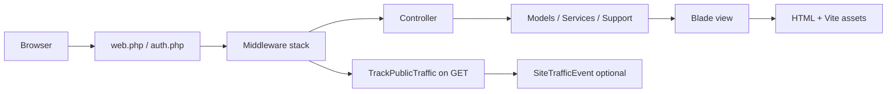

# MyAuto-Torque — Site behavior, features, and codebase guide

This document describes **how the application works**, **what features exist**, and **how the codebase is organized**. For install commands and environment variables, see the project **[README](../README.md)**.

---

## 1. What this application is

**MyAuto-Torque** is a **vehicle marketplace / dealer inventory** web app backed by **Laravel 12**. Sellers (and staff) manage listings; the public browses inventory, compares vehicles, saves favorites, and submits inquiries. **Administrators** moderate listings, edit CMS content, manage media, and review traffic analytics.

There is **no separate JSON API surface** used by a SPA: pages are **server-rendered with Blade**. Interactivity uses **Alpine.js** and form posts with CSRF tokens. Assets are bundled with **Vite**.

---

## 2. Technology stack

| Area | Choice |
|------|--------|
| Language | PHP 8.2+ |
| Framework | Laravel 12 |
| HTTP | Traditional `web` routes only (`routes/web.php` + `routes/auth.php`; no `routes/api.php` wired in `bootstrap/app.php`) |
| Templates | Blade (`resources/views/`) |
| CSS | Tailwind CSS |
| JS | Alpine.js (`resources/js/app.js`); ApexCharts on admin analytics (`resources/js/admin-analytics.js`) |
| Assets | Vite (`vite.config.js`) |
| Database | SQLite (local dev) or MySQL (production), via Laravel config |
| Auth | Session-based; Laravel Breeze-derived flows, extended |
| Roles | [Spatie Laravel Permission](https://spatie.be/docs/laravel-permission) (`admin`, `user`) |
| OAuth | Laravel Socialite (Google sign-in) |
| Mail | PHPMailer SMTP (`MAIL_PHPMAILER_*`, `MAIL_FROM_*`) |

---

## 3. Repository layout (application code)

All application source lives under **`backend/`**:

| Path | Purpose |
|------|---------|
| `routes/web.php` | Public pages, dashboard, seller vehicles, admin, media, compares, favorites, etc. |
| `routes/auth.php` | Login, register, Google OAuth, OTP flows, password reset, email verification |
| `routes/console.php` | Scheduled/custom Artisan closures (including schema export helpers) |
| `bootstrap/app.php` | App bootstrap: routes, middleware registration, middleware aliases |
| `app/Http/Controllers/` | Feature controllers (`PageController`, `UserVehicleController`, `Admin*`, `Auth/*`, …) |
| `app/Http/Middleware/` | Cross-cutting HTTP behavior (traffic tracking, audit, roles, OTP guards) |
| `app/Models/` | Eloquent models (`User`, `Vehicle`, CMS, analytics, …) |
| `app/Services/` | Domain services (`Mail`, `Auth/EmailOtpService`, `CurrencyRateService`) |
| `app/Support/` | Stateless helpers (`Compare`, `VehicleImageUrl`, `CurrencyCatalog`, …) |
| `config/` | Laravel configuration (`config/app.php` includes `admin_bootstrap_enabled`) |
| `database/migrations/` | Schema definitions |
| `database/seeders/` | Roles, demo users, vehicles, CMS, settings, media |
| `resources/views/` | Blade layouts, pages, dashboard, admin, auth, email templates |
| `resources/css/`, `resources/js/` | Vite entrypoints |
| `public/` | Web root; static demo images; `storage` symlink for uploads |

**Third-party PHP code** is under `vendor/` (do not edit for product behavior).

---

## 4. Request lifecycle (how a page “works”)

1. The browser requests a URL registered in **`routes/web.php`** (or **`routes/auth.php`**).
2. Laravel runs the **web middleware** group. **After** the response is built, **`TrackPublicTraffic`** may record a **`SiteTrafficEvent`** for eligible **GET** requests (fail-open: DB errors do not break pages).
3. The matched **controller** loads data via **Eloquent**, **Services**, or **Support** classes.
4. The controller returns a **Blade** view (or redirect). Views include Vite-built CSS/JS and use **session flash**, **validation errors**, and **auth user** as usual.

**Admin** routes add:

- `auth` (where required) + **`role:admin`** (`EnsureUserHasRole`)
- **`admin.audit`** (`TrackAdminAuditTrail`) to log admin actions

---

## 5. Roles and permissions

- **Spatie** roles: **`admin`**, **`user`** (see `database/seeders/RolesSeeder.php`).
- **Admins** use the **same login URL** as everyone else (`/login`). There is no separate admin login route; `/admin/login` redirects to `/login`.
- Authorization is enforced with middleware **`role:admin`** on `/admin/*` groups and with `$user->hasRole('admin')` in controller/view logic where needed.
- **Staff listings**: a vehicle owned by a user with the **`admin`** role is treated as a staff listing (`Vehicle::isStaffListing()`).

---

## 6. Feature catalog

### 6.1 Public / marketing

| Feature | Behavior (summary) | Primary code |
|--------|---------------------|--------------|
| **Home** | Hero, recent approved vehicles, configurable sections from DB + defaults | `PageController@home`, `pages/home-luxemotive.blade.php`, `PageSection` / `SiteSetting` |
| **About / FAQ / Contact** | Static-ish pages; contact form posts | `PageController`, `ContactController` |
| **Inventory index** | Filterable list of **approved** vehicles | `PageController@inventory` |
| **Vehicle detail** | Single listing; inquiry form; financing display flags | `PageController@vehicleShow`, `VehicleInquiryController` |
| **Compare** | Session-stored list of vehicle IDs (add/remove/clear) | `CompareController`, `App\Support\Compare` |
| **Currency** | User preference for display currency (where implemented) | `CurrencyPreferenceController`, `CurrencyRateService`, `CurrencyCatalog` |
| **Newsletter** | Subscribe endpoint (throttled) | `NewsletterController` |
| **Public media URL** | Serves storage-backed files under a controlled route | `PublicStorageMediaController` (`/media/storage/{path}`) |

### 6.2 Authentication and account security

| Feature | Notes | Code |
|--------|------|------|
| **Unified login/register UI** | Single entry presentation for guests | `UnifiedAuthController`, `auth/unified.blade.php` |
| **Email + password** | Standard session login | `AuthenticatedSessionController` |
| **Registration** | Creates user; verification / OTP steps per app config | `RegisteredUserController`, `RegisterOtpController` |
| **Login OTP** | Optional second step after password | `LoginOtpChallengeController`, `EmailOtpService` |
| **Google OAuth** | Socialite redirect/callback | `GoogleAuthController` |
| **Password reset** | Email link flow | `PasswordResetLinkController`, `NewPasswordController` |
| **Email verification** | Laravel verification routes | `auth.php` (VerifyEmail, etc.) |
| **Rate limits** | `throttle` middleware on sensitive POST routes | `routes/web.php`, `routes/auth.php` |

### 6.3 Logged-in user (non-admin) — “seller” dashboard

| Feature | Notes | Code |
|--------|------|------|
| **Dashboard** | Stats for **my** vehicles vs global stats for admins | Closure in `web.php` → `dashboard.blade.php` |
| **Profile** | Name, email, password, delete account | `ProfileController` |
| **Seller / vendor profile** | Branding or contact prefs for listings | `VendorSettingsController`, `VendorProfile` |
| **Vehicle CRUD** | Create/edit listings, images, submit for approval | `UserVehicleController`, views under `dashboard/vehicles/` |
| **Favorites** | Saved approved listings | `FavoriteController`, `vehicle_favorites` pivot |

Listing **status** flows through values such as **`pending`** / **`approved`** (and rejection with reason); admins approve or reject (`AdminVehicleController`).

### 6.4 Admin area (`/admin`)

Requires **`auth`** + **`role:admin`** + **`admin.audit`** (except where nested rules apply).

| Feature | Notes | Code |
|--------|------|------|
| **Admin dashboard** | High-level counts, analytics summary, audit summary | Closure in `web.php`, `admin/dashboard.blade.php` |
| **Analytics** | Charts / data endpoints for traffic | `AdminAnalyticsController`, `resources/js/admin-analytics.js`, ApexCharts |
| **Audit trail** | Searchable log of admin requests | Closure in `web.php`, `AdminAuditTrail` model |
| **Users** | List/create/remove users | `AdminUserController` |
| **Approve / reject listings** | Moderation actions | `AdminVehicleController`; redirects reuse seller edit routes where noted in `web.php` |
| **CMS pages** | Edit page metadata/content | `AdminPageController`, `CmsPage`, `PageSection` |
| **Media library** | Upload, delete, bulk delete, JSON list for pickers | `AdminMediaController` |
| **Site settings** | Key/value site configuration | `AdminSiteSettingsController`, `SiteSetting` |

### 6.5 First-time admin bootstrap

When **`ADMIN_BOOTSTRAP_ENABLED=true`** in `.env` (see **`config/app.php`** → **`admin_bootstrap_enabled`**), guests can reach **`/bootstrap-admin`** once to create the first admin account. **Disable this in production** after use (see also `backend/database/README.md`).

---

## 7. Data model (conceptual)

| Model | Role |
|-------|------|
| `User` | Auth user; roles; owns `Vehicle`; favorites; optional `VendorProfile` |
| `Vehicle` | Marketplace listing with rich attributes, status, approval metadata |
| `VehicleImage` | Ordered gallery rows; paths resolved for public URLs (`VehicleImageUrl`) |
| `VehicleInquiry` | Lead submissions from inventory detail pages |
| `VendorProfile` | Seller-specific display/settings |
| `CmsPage` | CMS page records (e.g. `home`; active flag) |
| `PageSection` | Key/value content blocks per logical page slug |
| `SiteSetting` | Global key/value settings (dealer phone, defaults, overlays with sections) |
| `Media` | Admin media library files metadata |
| `SiteTrafficEvent` | Anonymous/coarse analytics events (GET tracking) |
| `AdminAuditTrail` | Who did what on admin routes |
| Spatie tables | Roles/permissions persistence |

Exact columns are defined in **`database/migrations/`**.

---

## 8. Email and notifications

Outbound email is centralized in **`App\Services\Mail\OutboundMailService`**, which sends via **PHPMailer** when **`MAIL_PHPMAILER_*`** is set (see **`README.md`**). Admins can send a test message from **Site settings** (`POST /admin/settings/mail-test`, throttled).

Blade layouts under **`resources/views/emails/`** render branded messages (OTP, password reset, contact, inquiries, listing approved/rejected, etc.—see filenames there).

---

## 9. Compare and session state

**Compare** does not use the database for guests: IDs are stored in the session (`App\Support\Compare`, key `compare.vehicle_ids`). `CompareController` mutates that list; the compare page reads it and resolves `Vehicle` models.

---

## 10. Frontend architecture

| Piece | Responsibility |
|-------|----------------|
| **`layouts/site.blade.php`** | Public site chrome (often with `partials/header`, `footer`) |
| **`layouts/app.blade.php`** | Authenticated app shell (navigation, dashboard-style) |
| **`layouts/admin.blade.php`** | Admin chrome |
| **`layouts/guest.blade.php`** | Auth pages |
| **`@vite`** (via **`partials/vite-assets.blade.php`**) | Loads built CSS/JS |
| **Alpine** | Lightweight dropdowns/toggles/interactions |

Admin analytics loads a dedicated JS bundle that depends on **ApexCharts** (`package.json`).

---

## 11. Configuration highlights (environment)

Do **not** commit secrets. Typical keys (details in **`README.md`** and **`.env.example`**):

- **App**: `APP_NAME`, `APP_URL`, `APP_ENV`, `APP_DEBUG`
- **DB**: `DB_CONNECTION`, `DB_HOST`, etc.
- **Mail / PHPMailer**: documented in `README.md` table; test send from Admin → Site settings
- **Google OAuth**: Socialite/Google client ID/secret (see Laravel/Socialite docs + `config/services.php`)
- **Admin bootstrap**: `ADMIN_BOOTSTRAP_ENABLED`
- **Proxies**: `TRUSTED_PROXIES` (see `bootstrap/app.php`)

---

## 12. Local development workflow

Composer script **`composer dev`** (see **`composer.json`**) can run **`php artisan serve`**, **`queue:listen`**, **`pail`**, and **`npm run dev`** together. Commonly:

- `composer install`, `npm install`
- `cp .env.example .env`, `php artisan key:generate`
- `php artisan migrate:fresh --seed` (or migrate + seed on existing DB)
- `php artisan storage:link`
- `npm run dev` + `php artisan serve`

Seeded demo accounts are defined in **`database/seeders/DemoData.php`** (currently **`admin@example.com`** and **`demo@example.com`**, password **`password`** unless you change factories/seed behavior). Roles are assigned in **`DatabaseSeeder`**.

---

## 13. Security-related behavior

- **CSRF**: Standard Laravel protection on web forms (`csrf-token` meta in layouts).
- **Throttling**: Applied to login, register, OTP, contact, inquiries, newsletter, currency, Google routes, etc.
- **Signed URLs**: Email verification links use Laravel signed middleware.
- **Role middleware**: Guards admin sections.
- **Fail-open analytics**: Public traffic tracking catches errors so pages still render.

---

## 14. Index of important entry files

Use this as a navigation map:

| File | Why read it |
|------|-------------|
| `routes/web.php` | Full URL map and feature grouping |
| `routes/auth.php` | All auth URLs |
| `bootstrap/app.php` | Middleware aliases, `TrustProxies` |
| `app/Http/Controllers/PageController.php` | Home, inventory, vehicle show, CMS section merging |
| `app/Http/Controllers/UserVehicleController.php` | Seller listing lifecycle |
| `app/Http/Controllers/AdminVehicleController.php` | Approve/reject |
| `app/Models/User.php`, `Vehicle.php` | Core relations and casts |
| `app/Services/Mail/OutboundMailService.php` | Mail pipeline |
| `app/Support/Compare.php` | Compare session semantics |
| `app/Http/Middleware/TrackPublicTraffic.php` | What gets counted as a “view” |
| `vite.config.js`, `resources/js/app.js` | Front-end toolchain |
| `database/seeders/DatabaseSeeder.php` | What demo data loads |

---

## 15. Changelog mindset

Behavior is defined by **routes + controllers + migrations + views**. When you change the product:

1. Add or adjust **routes**.
2. Implement **controller/service** logic.
3. Persist via **migration** + **model** updates.
4. Render in **Blade**; add assets via **Vite** if needed.
5. Seed or document required **roles/settings** if operators need defaults.

---

*This guide reflects the codebase structure at the time it was written. If something diverges, treat `routes/web.php` and migrations as the source of truth.*
