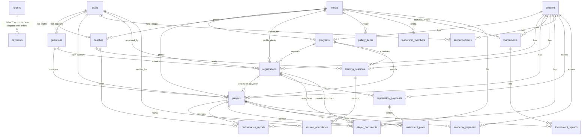

# PowerBlink FC — Database Entity Relationship Diagram

**Document:** `01-database-erd.md`  
**Version:** 1.0  
**Status:** Phase 0 specification (pre-implementation)  
**Last updated:** 2026-06-24

This document defines the complete academy database schema for the PowerBlink FC Academy Management System. It replaces the Vogue Dress ecommerce domain (`vehicles`, `orders`, `payments`) with season-aware academy tables while **keeping the legacy `payments` table unchanged** until ecommerce is dropped. All new Paystack activity writes to `registration_payments` and `academy_payments` only.

---

## Table of contents

1. [Entity relationship diagram](#entity-relationship-diagram)
2. [Soft deletes policy](#soft-deletes-policy)
3. [Payment table separation](#payment-table-separation)
4. [Retained infrastructure tables](#retained-infrastructure-tables)
5. [Academy table definitions](#academy-table-definitions)
6. [Indexes summary](#indexes-summary)
7. [Media storage convention](#media-storage-convention)

---

## Entity relationship diagram

---

## Soft deletes policy

Laravel `SoftDeletes` (`deleted_at` timestamp, nullable) applies to **major academy entities** where archival is required without destroying historical records.

| Table | SoftDeletes | Operational status column |
|-------|-------------|---------------------------|
| `seasons` | Yes | `is_active` |
| `programs` | Yes | `is_active` |
| `guardians` | Yes | — |
| `registrations` | Yes | `status` |
| `players` | Yes | `status` (active \| injured \| inactive) |
| `coaches` | Yes | `is_active` |
| `tournaments` | Yes | `status` |
| `training_sessions` | Yes | — |
| `leadership_members` | Yes | — |
| All other academy tables | No | Use `status` or hard delete as appropriate |

**Important distinction:** When a player leaves the academy, set `players.status = inactive`. Use soft delete only for erroneous records, GDPR-style removal requests, or admin archival. Training attendance and payment history must remain queryable for inactive players.

---

## Payment table separation

| Table | Purpose | Lifecycle |
|-------|---------|-----------|
| `payments` (existing) | Ecommerce order payments via Paystack | **Never alter schema.** Dropped together with `orders` and `order_items` when ecommerce is removed. |
| `registration_payments` (new) | Registration fees and installment payments during onboarding | Created at tokenized payment page; webhook writes `success` / `failed` |
| `academy_payments` (new) | Post-activation fees: monthly fees, tournament fees | Phase 3 finance module; `player_id` required |

Academy Paystack webhooks and `RegistrationPaymentCompletionService` write **only** to `registration_payments` / `academy_payments`. The legacy `Payment` model and `OrderPaymentCompletionService` are deleted with ecommerce.

---

## Retained infrastructure tables

These tables are **kept** from the existing Laravel codebase (no structural changes unless noted):

| Table | Notes |
|-------|-------|
| `users` | Auth; `is_super_admin` flag for super admin |
| `sessions` | Laravel session driver |
| `password_reset_tokens` | Breeze password reset |
| `permissions`, `roles`, `model_has_permissions`, `model_has_roles`, `role_has_permissions` | Spatie; permission names replaced in seeder |
| `media` | Extended with `category`, `alt_text` (nullable) |
| `cms_pages`, `page_sections` | CMS copy for public pages |
| `site_settings` | Contact, branding, social links |
| `admin_audit_trails` | Admin action log |
| `site_traffic_events` | Analytics |
| `jobs`, `job_batches`, `failed_jobs` | Queue |
| `cache`, `cache_locks` | Cache |
| `notifications` | Laravel database notifications (new migration) |

---

## Academy table definitions

Column types follow Laravel/MySQL conventions: `bigIncrements` → `BIGINT UNSIGNED`, `string` → `VARCHAR(255)` unless noted, `text` → `TEXT`, `json` → `JSON`, `boolean` → `TINYINT(1)`, `unsignedInteger` → `INT UNSIGNED`, amounts in **kobo** (integer).

### `seasons`

| Column | Type | Nullable | Default | Notes |
|--------|------|----------|---------|-------|
| `id` | BIGINT UNSIGNED | No | auto | PK |
| `name` | VARCHAR(255) | No | — | e.g. "2026 Season" |
| `start_date` | DATE | No | — | |
| `end_date` | DATE | No | — | |
| `is_active` | BOOLEAN | No | false | Only one active recommended |
| `created_at` | TIMESTAMP | Yes | — | |
| `updated_at` | TIMESTAMP | Yes | — | |
| `deleted_at` | TIMESTAMP | Yes | — | SoftDeletes |

**Indexes:** `seasons_is_active_index` on (`is_active`)

---

### `programs`

| Column | Type | Nullable | Default | Notes |
|--------|------|----------|---------|-------|
| `id` | BIGINT UNSIGNED | No | auto | PK |
| `season_id` | BIGINT UNSIGNED | No | — | FK → `seasons.id` |
| `name` | VARCHAR(255) | No | — | e.g. "U10 Development" |
| `age_group` | VARCHAR(16) | No | — | U7, U10, U13, U15 |
| `description` | TEXT | Yes | — | |
| `monthly_fee` | UNSIGNED INT | No | 0 | Kobo |
| `registration_fee` | UNSIGNED INT | No | 0 | Kobo |
| `max_capacity` | UNSIGNED SMALLINT | Yes | — | |
| `sessions_per_week` | UNSIGNED TINYINT | Yes | — | |
| `is_active` | BOOLEAN | No | true | |
| `hero_image_media_id` | BIGINT UNSIGNED | Yes | — | FK → `media.id` |
| `sort_order` | UNSIGNED SMALLINT | No | 0 | |
| `created_at` | TIMESTAMP | Yes | — | |
| `updated_at` | TIMESTAMP | Yes | — | |
| `deleted_at` | TIMESTAMP | Yes | — | SoftDeletes |

**Foreign keys:**
- `programs_season_id_foreign` → `seasons(id)` ON DELETE RESTRICT
- `programs_hero_image_media_id_foreign` → `media(id)` ON DELETE SET NULL

**Indexes:** `programs_season_id_age_group_index` on (`season_id`, `age_group`)

---

### `guardians`

| Column | Type | Nullable | Default | Notes |
|--------|------|----------|---------|-------|
| `id` | BIGINT UNSIGNED | No | auto | PK |
| `user_id` | BIGINT UNSIGNED | Yes | — | FK → `users.id` (parent portal login) |
| `name` | VARCHAR(255) | No | — | |
| `phone` | VARCHAR(32) | No | — | |
| `email` | VARCHAR(255) | No | — | |
| `address` | TEXT | Yes | — | |
| `relationship` | VARCHAR(64) | Yes | — | e.g. Mother, Father |
| `emergency_contact_name` | VARCHAR(255) | Yes | — | |
| `emergency_contact_phone` | VARCHAR(32) | Yes | — | |
| `emergency_contact_relationship` | VARCHAR(64) | Yes | — | |
| `created_at` | TIMESTAMP | Yes | — | |
| `updated_at` | TIMESTAMP | Yes | — | |
| `deleted_at` | TIMESTAMP | Yes | — | SoftDeletes |

**Foreign keys:** `guardians_user_id_foreign` → `users(id)` ON DELETE SET NULL

**Indexes:** `guardians_email_index`, `guardians_user_id_index`

---

### `registrations`

| Column | Type | Nullable | Default | Notes |
|--------|------|----------|---------|-------|
| `id` | BIGINT UNSIGNED | No | auto | PK |
| `reference_code` | VARCHAR(32) | No | — | Unique, e.g. REG-2026-0042 |
| `season_id` | BIGINT UNSIGNED | No | — | FK → `seasons.id` |
| `program_id` | BIGINT UNSIGNED | No | — | FK → `programs.id` |
| `guardian_id` | BIGINT UNSIGNED | No | — | FK → `guardians.id` |
| `status` | VARCHAR(32) | No | pending_review | See enum below |
| `payment_plan` | VARCHAR(32) | No | lump_sum | lump_sum \| installments |
| `payment_token` | CHAR(36) | Yes | — | UUID, unique |
| `payment_token_expires_at` | TIMESTAMP | Yes | — | Default +7 days on approve |
| `payment_token_used_at` | TIMESTAMP | Yes | — | Set on successful payment |
| `player_name` | VARCHAR(255) | No | — | |
| `date_of_birth` | DATE | No | — | |
| `nationality` | VARCHAR(64) | Yes | — | |
| `primary_position` | VARCHAR(64) | Yes | — | |
| `secondary_position` | VARCHAR(64) | Yes | — | |
| `years_experience` | UNSIGNED TINYINT | Yes | — | |
| `technical_strengths` | TEXT | Yes | — | |
| `allergies` | TEXT | Yes | — | Sensitive |
| `medical_history` | TEXT | Yes | — | Sensitive |
| `fitness_certified` | BOOLEAN | No | false | |
| `profile_photo_media_id` | BIGINT UNSIGNED | Yes | — | FK → `media.id` |
| `emergency_contact_name` | VARCHAR(255) | Yes | — | Snapshot at submit |
| `emergency_contact_phone` | VARCHAR(32) | Yes | — | Snapshot at submit |
| `emergency_contact_relationship` | VARCHAR(64) | Yes | — | Snapshot at submit |
| `approved_by` | BIGINT UNSIGNED | Yes | — | FK → `users.id` |
| `approved_at` | TIMESTAMP | Yes | — | |
| `rejected_reason` | TEXT | Yes | — | |
| `rejected_at` | TIMESTAMP | Yes | — | |
| `submitted_at` | TIMESTAMP | Yes | — | |
| `created_at` | TIMESTAMP | Yes | — | |
| `updated_at` | TIMESTAMP | Yes | — | |
| `deleted_at` | TIMESTAMP | Yes | — | SoftDeletes |

**Status enum:** `pending_review`, `rejected`, `awaiting_payment`, `activated`

**Foreign keys:**
- `registrations_season_id_foreign` → `seasons(id)` ON DELETE RESTRICT
- `registrations_program_id_foreign` → `programs(id)` ON DELETE RESTRICT
- `registrations_guardian_id_foreign` → `guardians(id)` ON DELETE RESTRICT
- `registrations_approved_by_foreign` → `users(id)` ON DELETE SET NULL
- `registrations_profile_photo_media_id_foreign` → `media(id)` ON DELETE SET NULL

**Indexes:**
- `registrations_reference_code_unique` UNIQUE (`reference_code`)
- `registrations_payment_token_unique` UNIQUE (`payment_token`)
- `registrations_status_index` on (`status`)
- `registrations_season_id_status_index` on (`season_id`, `status`)

---

### `players`

| Column | Type | Nullable | Default | Notes |
|--------|------|----------|---------|-------|
| `id` | BIGINT UNSIGNED | No | auto | PK |
| `registration_id` | BIGINT UNSIGNED | Yes | — | FK → `registrations.id` |
| `user_id` | BIGINT UNSIGNED | Yes | — | FK → `users.id` (player portal) |
| `guardian_id` | BIGINT UNSIGNED | No | — | FK → `guardians.id` |
| `program_id` | BIGINT UNSIGNED | No | — | FK → `programs.id` |
| `season_id` | BIGINT UNSIGNED | No | — | FK → `seasons.id` |
| `player_code` | VARCHAR(32) | No | — | Unique, e.g. PB-2026-0001 |
| `photo_media_id` | BIGINT UNSIGNED | Yes | — | FK → `media.id` |
| `player_name` | VARCHAR(255) | No | — | Snapshot from registration |
| `date_of_birth` | DATE | No | — | |
| `nationality` | VARCHAR(64) | Yes | — | |
| `primary_position` | VARCHAR(64) | Yes | — | |
| `secondary_position` | VARCHAR(64) | Yes | — | |
| `years_experience` | UNSIGNED TINYINT | Yes | — | |
| `technical_strengths` | TEXT | Yes | — | |
| `allergies` | TEXT | Yes | — | |
| `medical_history` | TEXT | Yes | — | |
| `status` | VARCHAR(32) | No | active | active \| injured \| inactive |
| `is_demo` | BOOLEAN | No | false | Demo seeder flag |
| `created_at` | TIMESTAMP | Yes | — | |
| `updated_at` | TIMESTAMP | Yes | — | |
| `deleted_at` | TIMESTAMP | Yes | — | SoftDeletes |

**Foreign keys:** All FKs ON DELETE RESTRICT except `user_id`, `photo_media_id`, `registration_id` → SET NULL

**Indexes:**
- `players_player_code_unique` UNIQUE (`player_code`)
- `players_season_id_program_id_index` on (`season_id`, `program_id`)
- `players_guardian_id_index` on (`guardian_id`)
- `players_status_index` on (`status`)

---

### `coaches`

| Column | Type | Nullable | Default | Notes |
|--------|------|----------|---------|-------|
| `id` | BIGINT UNSIGNED | No | auto | PK |
| `user_id` | BIGINT UNSIGNED | Yes | — | FK → `users.id` |
| `name` | VARCHAR(255) | No | — | |
| `title` | VARCHAR(128) | Yes | — | e.g. Head Coach |
| `bio` | TEXT | Yes | — | |
| `specialization` | VARCHAR(128) | Yes | — | |
| `certifications` | JSON | Yes | — | e.g. ["UEFA B", "CAF C"] |
| `experience_years` | UNSIGNED SMALLINT | Yes | — | |
| `license_level` | VARCHAR(64) | Yes | — | |
| `email` | VARCHAR(255) | Yes | — | |
| `phone` | VARCHAR(32) | Yes | — | |
| `photo_media_id` | BIGINT UNSIGNED | Yes | — | FK → `media.id` |
| `is_active` | BOOLEAN | No | true | |
| `sort_order` | UNSIGNED SMALLINT | No | 0 | |
| `created_at` | TIMESTAMP | Yes | — | |
| `updated_at` | TIMESTAMP | Yes | — | |
| `deleted_at` | TIMESTAMP | Yes | — | SoftDeletes |

**Indexes:** `coaches_is_active_sort_order_index` on (`is_active`, `sort_order`)

---

### `training_sessions`

| Column | Type | Nullable | Default | Notes |
|--------|------|----------|---------|-------|
| `id` | BIGINT UNSIGNED | No | auto | PK |
| `season_id` | BIGINT UNSIGNED | No | — | FK → `seasons.id` |
| `program_id` | BIGINT UNSIGNED | No | — | FK → `programs.id` |
| `coach_id` | BIGINT UNSIGNED | Yes | — | FK → `coaches.id` |
| `title` | VARCHAR(255) | No | — | |
| `session_type` | VARCHAR(64) | Yes | — | e.g. technical, match_prep |
| `date` | DATE | No | — | |
| `start_time` | TIME | No | — | |
| `end_time` | TIME | No | — | |
| `location` | VARCHAR(255) | Yes | — | |
| `notes` | TEXT | Yes | — | |
| `created_at` | TIMESTAMP | Yes | — | |
| `updated_at` | TIMESTAMP | Yes | — | |
| `deleted_at` | TIMESTAMP | Yes | — | SoftDeletes |

**Indexes:** `training_sessions_season_id_date_index` on (`season_id`, `date`)

---

### `session_attendance`

| Column | Type | Nullable | Default | Notes |
|--------|------|----------|---------|-------|
| `id` | BIGINT UNSIGNED | No | auto | PK |
| `training_session_id` | BIGINT UNSIGNED | No | — | FK → `training_sessions.id` |
| `player_id` | BIGINT UNSIGNED | No | — | FK → `players.id` |
| `status` | VARCHAR(32) | No | absent | present \| absent \| late \| excused |
| `remarks` | TEXT | Yes | — | |
| `created_at` | TIMESTAMP | Yes | — | |
| `updated_at` | TIMESTAMP | Yes | — | |

**Foreign keys:** ON DELETE CASCADE for session; RESTRICT for player

**Indexes:** `session_attendance_training_session_id_player_id_unique` UNIQUE (`training_session_id`, `player_id`)

---

### `performance_reports`

| Column | Type | Nullable | Default | Notes |
|--------|------|----------|---------|-------|
| `id` | BIGINT UNSIGNED | No | auto | PK |
| `season_id` | BIGINT UNSIGNED | No | — | FK → `seasons.id` |
| `player_id` | BIGINT UNSIGNED | No | — | FK → `players.id` |
| `coach_id` | BIGINT UNSIGNED | No | — | FK → `coaches.id` |
| `passing` | UNSIGNED TINYINT | Yes | — | 0–100 |
| `dribbling` | UNSIGNED TINYINT | Yes | — | |
| `speed` | UNSIGNED TINYINT | Yes | — | |
| `fitness` | UNSIGNED TINYINT | Yes | — | |
| `discipline` | UNSIGNED TINYINT | Yes | — | |
| `teamwork` | UNSIGNED TINYINT | Yes | — | |
| `overall_score` | UNSIGNED TINYINT | Yes | — | Computed or stored |
| `comments` | TEXT | Yes | — | |
| `reported_at` | TIMESTAMP | No | — | |
| `created_at` | TIMESTAMP | Yes | — | |
| `updated_at` | TIMESTAMP | Yes | — | |

**Indexes:** `performance_reports_player_id_reported_at_index` on (`player_id`, `reported_at`)

---

### `registration_payments`

| Column | Type | Nullable | Default | Notes |
|--------|------|----------|---------|-------|
| `id` | BIGINT UNSIGNED | No | auto | PK |
| `registration_id` | BIGINT UNSIGNED | No | — | FK → `registrations.id` |
| `player_id` | BIGINT UNSIGNED | Yes | — | FK → `players.id` (set on activation) |
| `season_id` | BIGINT UNSIGNED | No | — | FK → `seasons.id` |
| `type` | VARCHAR(32) | No | — | registration_fee \| installment |
| `provider` | VARCHAR(32) | No | paystack | |
| `reference` | VARCHAR(128) | No | — | Paystack reference, unique |
| `status` | VARCHAR(32) | No | pending | pending \| success \| failed |
| `amount` | UNSIGNED INT | No | — | Kobo |
| `currency` | VARCHAR(8) | No | NGN | |
| `gateway_payload` | JSON | Yes | — | Raw webhook data |
| `paid_at` | TIMESTAMP | Yes | — | |
| `created_at` | TIMESTAMP | Yes | — | |
| `updated_at` | TIMESTAMP | Yes | — | |

**Foreign keys:** All ON DELETE RESTRICT

**Indexes:**
- `registration_payments_reference_unique` UNIQUE (`reference`)
- `registration_payments_registration_id_status_index` on (`registration_id`, `status`)

---

### `academy_payments`

Same schema as `registration_payments` with these differences:

| Column | Difference |
|--------|------------|
| `registration_id` | Nullable (post-activation only) |
| `player_id` | **Required** |
| `type` | `monthly_fee` \| `tournament_fee` |

**Indexes:**
- `academy_payments_reference_unique` UNIQUE (`reference`)
- `academy_payments_player_id_status_index` on (`player_id`, `status`)

---

### `installment_plans`

| Column | Type | Nullable | Default | Notes |
|--------|------|----------|---------|-------|
| `id` | BIGINT UNSIGNED | No | auto | PK |
| `registration_id` | BIGINT UNSIGNED | No | — | FK → `registrations.id` |
| `player_id` | BIGINT UNSIGNED | Yes | — | FK → `players.id` |
| `amount` | UNSIGNED INT | No | — | Kobo |
| `due_date` | DATE | No | — | |
| `status` | VARCHAR(32) | No | pending | pending \| paid \| overdue |
| `registration_payment_id` | BIGINT UNSIGNED | Yes | — | FK → `registration_payments.id` |
| `created_at` | TIMESTAMP | Yes | — | |
| `updated_at` | TIMESTAMP | Yes | — | |

**Indexes:** `installment_plans_registration_id_due_date_index` on (`registration_id`, `due_date`)

---

### `player_documents`

| Column | Type | Nullable | Default | Notes |
|--------|------|----------|---------|-------|
| `id` | BIGINT UNSIGNED | No | auto | PK |
| `player_id` | BIGINT UNSIGNED | Yes | — | FK → `players.id` |
| `registration_id` | BIGINT UNSIGNED | Yes | — | FK → `registrations.id` (pre-activation) |
| `document_type` | VARCHAR(64) | No | — | birth_certificate, passport_photo, medical_clearance, parent_consent, registration_form |
| `media_id` | BIGINT UNSIGNED | No | — | FK → `media.id` |
| `status` | VARCHAR(32) | No | pending | pending \| verified \| rejected |
| `verified_by` | BIGINT UNSIGNED | Yes | — | FK → `users.id` |
| `verified_at` | TIMESTAMP | Yes | — | |
| `created_at` | TIMESTAMP | Yes | — | |
| `updated_at` | TIMESTAMP | Yes | — | |

**Indexes:** `player_documents_player_id_document_type_index` on (`player_id`, `document_type`)

---

### `tournaments`

| Column | Type | Nullable | Default | Notes |
|--------|------|----------|---------|-------|
| `id` | BIGINT UNSIGNED | No | auto | PK |
| `season_id` | BIGINT UNSIGNED | No | — | FK → `seasons.id` |
| `title` | VARCHAR(255) | No | — | |
| `category` | VARCHAR(64) | Yes | — | |
| `start_date` | DATE | No | — | |
| `end_date` | DATE | Yes | — | |
| `location` | VARCHAR(255) | Yes | — | |
| `description` | TEXT | Yes | — | |
| `status` | VARCHAR(32) | No | upcoming | upcoming \| active \| completed \| cancelled |
| `max_teams` | UNSIGNED SMALLINT | Yes | — | |
| `featured_image_media_id` | BIGINT UNSIGNED | Yes | — | FK → `media.id` |
| `created_at` | TIMESTAMP | Yes | — | |
| `updated_at` | TIMESTAMP | Yes | — | |
| `deleted_at` | TIMESTAMP | Yes | — | SoftDeletes |

---

### `tournament_squads`

| Column | Type | Nullable | Default | Notes |
|--------|------|----------|---------|-------|
| `id` | BIGINT UNSIGNED | No | auto | PK |
| `tournament_id` | BIGINT UNSIGNED | No | — | FK → `tournaments.id` |
| `player_id` | BIGINT UNSIGNED | No | — | FK → `players.id` |
| `position` | VARCHAR(64) | Yes | — | Squad position |
| `created_at` | TIMESTAMP | Yes | — | |
| `updated_at` | TIMESTAMP | Yes | — | |

**Indexes:** `tournament_squads_tournament_id_player_id_unique` UNIQUE (`tournament_id`, `player_id`)

---

### `announcements`

| Column | Type | Nullable | Default | Notes |
|--------|------|----------|---------|-------|
| `id` | BIGINT UNSIGNED | No | auto | PK |
| `season_id` | BIGINT UNSIGNED | Yes | — | FK → `seasons.id` |
| `title` | VARCHAR(255) | No | — | |
| `body` | TEXT | No | — | |
| `audience` | VARCHAR(64) | No | all | all \| parents \| coaches \| program:{id} |
| `channel` | VARCHAR(32) | No | in_app | email \| in_app \| both |
| `published_at` | TIMESTAMP | Yes | — | |
| `created_by` | BIGINT UNSIGNED | No | — | FK → `users.id` |
| `created_at` | TIMESTAMP | Yes | — | |
| `updated_at` | TIMESTAMP | Yes | — | |

**Indexes:** `announcements_published_at_index` on (`published_at`)

---

### `gallery_items`

| Column | Type | Nullable | Default | Notes |
|--------|------|----------|---------|-------|
| `id` | BIGINT UNSIGNED | No | auto | PK |
| `media_id` | BIGINT UNSIGNED | No | — | FK → `media.id` |
| `title` | VARCHAR(255) | Yes | — | |
| `category` | VARCHAR(64) | No | — | training \| matches \| awards \| community \| tournaments |
| `sort_order` | UNSIGNED SMALLINT | No | 0 | |
| `is_published` | BOOLEAN | No | true | |
| `created_at` | TIMESTAMP | Yes | — | |
| `updated_at` | TIMESTAMP | Yes | — | |

---

### `leadership_members`

| Column | Type | Nullable | Default | Notes |
|--------|------|----------|---------|-------|
| `id` | BIGINT UNSIGNED | No | auto | PK |
| `name` | VARCHAR(255) | No | — | |
| `title` | VARCHAR(128) | No | — | |
| `bio` | TEXT | Yes | — | |
| `photo_media_id` | BIGINT UNSIGNED | Yes | — | FK → `media.id` |
| `sort_order` | UNSIGNED SMALLINT | No | 0 | |
| `created_at` | TIMESTAMP | Yes | — | |
| `updated_at` | TIMESTAMP | Yes | — | |
| `deleted_at` | TIMESTAMP | Yes | — | SoftDeletes |

---

### `timeline_events`

| Column | Type | Nullable | Default | Notes |
|--------|------|----------|---------|-------|
| `id` | BIGINT UNSIGNED | No | auto | PK |
| `year` | UNSIGNED SMALLINT | No | — | |
| `title` | VARCHAR(255) | No | — | |
| `description` | TEXT | Yes | — | |
| `sort_order` | UNSIGNED SMALLINT | No | 0 | |
| `created_at` | TIMESTAMP | Yes | — | |
| `updated_at` | TIMESTAMP | Yes | — | |

---

### `media` (extension)

Existing table; add columns via migration:

| Column | Type | Nullable | Notes |
|--------|------|----------|-------|
| `category` | VARCHAR(64) | Yes | e.g. players, coaches, gallery |
| `alt_text` | VARCHAR(255) | Yes | Accessibility |

---

### `notifications` (Laravel standard)

| Column | Type | Notes |
|--------|------|-------|
| `id` | UUID | PK |
| `type` | VARCHAR(255) | Notification class |
| `notifiable_type` | VARCHAR(255) | Morph |
| `notifiable_id` | BIGINT UNSIGNED | Morph |
| `data` | TEXT | JSON payload |
| `read_at` | TIMESTAMP | Nullable |
| `created_at` | TIMESTAMP | |
| `updated_at` | TIMESTAMP | |

**Indexes:** `notifications_notifiable_type_notifiable_id_read_at_index`

---

## Indexes summary

Beyond per-table indexes above, apply these conventions:

- All foreign key columns indexed automatically by Laravel migrations
- Unique business keys: `player_code`, `reference_code`, `payment_token`, Paystack `reference`
- Composite indexes on common admin filters: (`season_id`, `status`), (`season_id`, `date`)
- No full-text indexes in Phase 1; search uses `LIKE` on name fields

---

## Media storage convention

| Path pattern | Purpose |
|--------------|---------|
| `public/asset/images/powerblink/players/` | Player photos |
| `public/asset/images/powerblink/coaches/` | Coach headshots |
| `public/asset/images/powerblink/programs/` | Program hero images |
| `public/asset/images/powerblink/gallery/` | Gallery items |
| `public/asset/images/powerblink/cms/` | CMS inline images |
| `public/asset/images/powerblink/tournaments/` | Tournament banners |
| `public/asset/images/powerblink/leadership/` | Board member photos |
| `public/asset/images/powerblink/brand/` | Crest logo (SVG + PNG) |
| `public/asset/images/powerblink/documents/` | Uploaded player documents |

All Blade views reference `asset/images/powerblink/...` paths stored in the `media` table. **Never** use external image URLs in production views.

---

## Related documents

- [02-role-permissions.md](./02-role-permissions.md) — Access control
- [03-application-flows.md](./03-application-flows.md) — Registration and payment flows
- [04-migration-plan.md](./04-migration-plan.md) — Schema migration execution
- [05-backup-recovery.md](./05-backup-recovery.md) — Backup before document uploads
