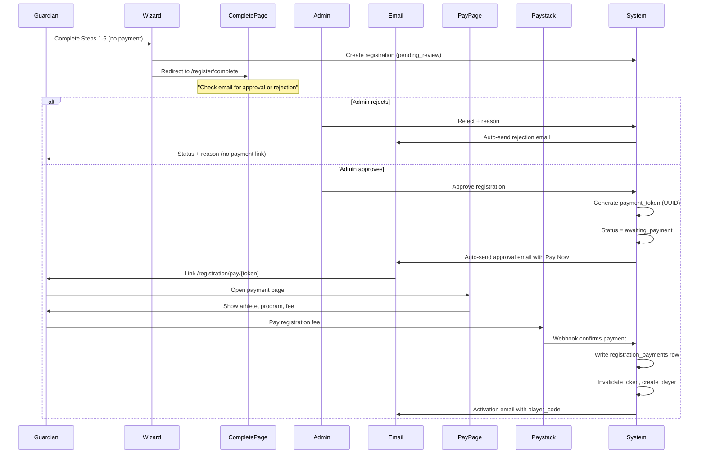
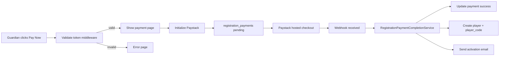
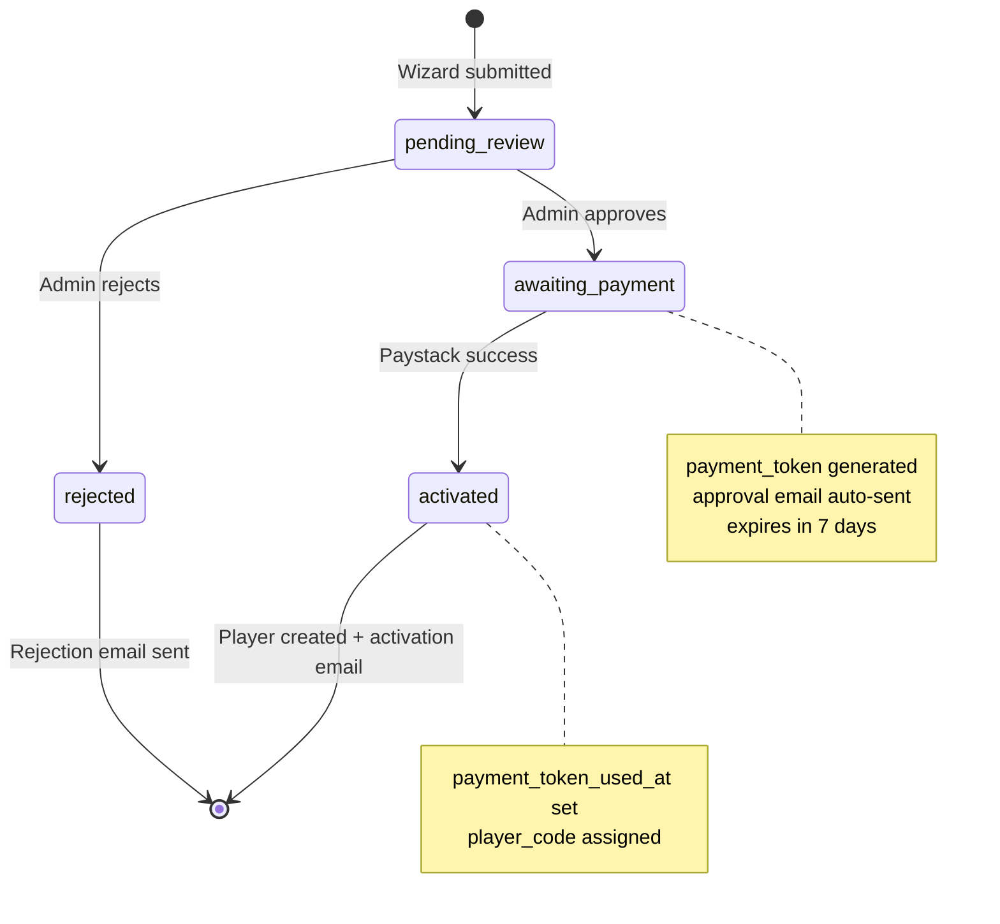

# PowerBlink FC — Application Flows

**Document:** `03-application-flows.md`  
**Version:** 1.0  
**Status:** Phase 0 specification (pre-implementation)  
**Last updated:** 2026-06-24

This document describes end-to-end application flows for PowerBlink FC: registration lifecycle, navigation structure, automated emails, and the tokenized payment system.

---

## Table of contents

1. [Registration lifecycle overview](#registration-lifecycle-overview)
2. [Six-step registration wizard](#six-step-registration-wizard)
3. [Post-submit confirmation page](#post-submit-confirmation-page)
4. [Admin review flow](#admin-review-flow)
5. [Tokenized payment flow](#tokenized-payment-flow)
6. [Player activation](#player-activation)
7. [Registration state machine](#registration-state-machine)
8. [Email triggers](#email-triggers)
9. [Primary application lifecycle](#primary-application-lifecycle)
10. [Public navigation](#public-navigation)
11. [Admin navigation](#admin-navigation)
12. [Member portal navigation](#member-portal-navigation)
13. [Shared layout architecture](#shared-layout-architecture)

---

## Registration lifecycle overview

PowerBlink FC uses an **approve-then-pay** model:

1. Guardian completes the 6-step wizard **without payment**
2. Registration is created with status `pending_review`
3. Admin approves or rejects
4. On approval, a single-use payment token is emailed
5. Guardian pays via tokenized Paystack page
6. On payment success, player record is created and activation email sent



---

## Six-step registration wizard

Route: `GET /register` → `RegistrationWizardController`

| Step | Title | Fields | Notes |
|------|-------|--------|-------|
| **1** | Player Information | Player name, date of birth, nationality, positions, years experience, technical strengths | |
| **2** | Guardian Details | Guardian name, relationship, phone, email, address | Creates or links `guardians` record |
| | Emergency Contact | Emergency contact name, phone, relationship (optional) | Snapshot stored on `registrations`; synced to `guardians` on activation |
| **3** | Medical & Fitness | Allergies, medical history, fitness certified checkbox | Sensitive data — see backup doc |
| **4** | Documents | Birth certificate, passport photo, medical clearance, parent consent | Uploads to `player_documents` (pre-activation, `registration_id` set) |
| **5** | Program & Payment Plan | Program selection, payment plan (lump sum vs installments) | **No Paystack** — plan stored on registration only |
| **6** | Review & Submit | Summary of all steps, terms acceptance | Submit creates registration |

**On submit:**

- `RegistrationService::submit()` creates `registrations` row with `status = pending_review`
- Generates `reference_code` (e.g. REG-2026-0042)
- Sets `submitted_at`
- Redirects to `/register/complete`
- Optional: sends acknowledgement email (confirmation page is primary UX)

---

## Post-submit confirmation page

Route: `GET /register/complete`

Displays (all content from `page_sections` or `site_settings`, not hardcoded):

- Success headline — application received
- Instruction to check guardian email for **approval or rejection**
- Explicit message: **do not pay until approved**
- `reference_code` from database
- **No payment button** on this page

Uses minimal public header variant (`public-header-minimal.blade.php`).

---

## Admin review flow

Route: `GET /admin/registrations` → Registrations queue

Admin actions from `registrations_powerblink_fc` design:

### Approve

1. Admin clicks **Approve** on a `pending_review` registration
2. System sets `status = awaiting_payment`
3. Generates `payment_token` (UUID v4)
4. Sets `payment_token_expires_at` = now + 7 days
5. Records `approved_by`, `approved_at`
6. **Automatically** sends approval email with Pay Now CTA via `OutboundMailService`

### Reject

1. Admin enters `rejected_reason`
2. System sets `status = rejected`, `rejected_at`
3. **Automatically** sends rejection email with reason
4. No payment token generated

### Re-approval after token expiry

Admin can regenerate token (new UUID, new expiry) and resend approval email.

---

## Tokenized payment flow

Each approved registration receives a dedicated payment access token. **Do not** use a generic checkout URL.

### Database columns (`registrations`)

| Column | Purpose |
|--------|---------|
| `payment_token` | Random UUID, indexed, unique |
| `payment_token_expires_at` | Default 7 days from approval |
| `payment_token_used_at` | Set when Paystack succeeds (single-use) |

### Routes

| Method | Route | Controller | Purpose |
|--------|-------|------------|---------|
| GET | `/registration/pay/{token}` | `RegistrationPaymentController@show` | Display payment page |
| POST | `/registration/pay/{token}` | `RegistrationPaymentController@initialize` | Initialize Paystack transaction |

### Middleware: `ValidateRegistrationPaymentToken`

Validates:

- Token exists in database
- Not expired (`payment_token_expires_at > now`)
- Not used (`payment_token_used_at` is null)
- Registration `status = awaiting_payment`

Invalid/expired/used token → friendly error page with **no data leak**.

### Payment page displays (all from DB)

- Player name
- Program name
- Registration fee (`programs.registration_fee`)
- Payment plan selected (lump sum or installment summary)
- Guardian name
- **Pay Now** button

### Paystack initialization

- Amount computed from program fee + payment plan logic
- Metadata includes `registration_id` and `type = registration_fee` for webhook verification
- Creates `registration_payments` row with `status = pending`
- Redirects to Paystack hosted page

### Webhook handling

`PaystackWebhookController` extended to route academy references to `RegistrationPaymentCompletionService` (parallel to existing `OrderPaymentCompletionService`, not a patch):

1. Verify Paystack signature
2. Match `reference` to `registration_payments` row
3. Update `status = success`, `paid_at`, `gateway_payload`
4. Set `payment_token_used_at`
5. Create `players` record with `player_code` (format `PB-{year}-{sequence}`)
6. Set registration `status = activated`
7. Sync emergency contact to `guardians` if not set
8. Send activation email



### Security rules

| Rule | Implementation |
|------|----------------|
| Token in URL only | No `registration_id` in query string |
| Single-use | `payment_token_used_at` set on success |
| Expiry | 7-day default; admin can regenerate |
| Webhook verification | Paystack signature + metadata `registration_id` |
| Amount integrity | Fee read from `programs` table, not client input |

---

## Player activation

On successful registration payment:

1. Copy profile fields from `registrations` to new `players` row
2. Generate unique `player_code`: `PB-{season_year}-{zero_padded_sequence}`
3. Link `players.registration_id`, `guardian_id`, `program_id`, `season_id`
4. Move pre-activation `player_documents` to `player_id`
5. Create `installment_plans` rows if `payment_plan = installments`
6. Optionally create `users` account for parent/player portal (Phase 4)
7. Send activation email with `player_code` and next steps

---

## Registration state machine



| Status | Description | Next actions |
|--------|-------------|--------------|
| `pending_review` | Awaiting admin decision | Approve or reject |
| `rejected` | Terminal state | None |
| `awaiting_payment` | Approved; payment token active | Pay or wait for expiry |
| `activated` | Payment received; player created | Normal academy operations |

---

## Email triggers

All emails sent via existing `OutboundMailService`. Templates: `resources/views/emails/registrations/*.blade.php` extending branded email layout.

| Trigger | Event | Recipient | Template | Content |
|---------|-------|-----------|----------|---------|
| Registration submitted | Wizard Step 6 submit | Guardian email | `registration-submitted` (optional) | Acknowledgement + reference code + pending review notice |
| Admin approves | `RegistrationService::approve()` | Guardian email | `registration-approved` | Congratulations + program/fee summary + **Pay Now** CTA button linking to `/registration/pay/{token}` |
| Admin rejects | `RegistrationService::reject()` | Guardian email | `registration-rejected` | Rejection notice + `rejected_reason` |
| Payment succeeds | `RegistrationPaymentCompletionService` | Guardian email | `registration-activated` | Player activated + `player_code` + portal login instructions |
| Announcement broadcast | Admin publishes announcement with `channel = email` | Audience segment | `announcement-broadcast` | Announcement title + body |
| Token expiry reminder (Phase 2+) | Scheduled job | Guardian email | `payment-reminder` | Reminder to pay before token expires |

### Email content rules

- All amounts formatted from database (kobo → NGN display)
- No hardcoded program names or fees in templates
- Pay Now button URL uses token only: `{APP_URL}/registration/pay/{payment_token}`
- From address: `info@powerblinkfc.com` (from `site_settings`)

---

## Primary application lifecycle

```mermaid
flowchart TD
    subgraph public [Public Site]
        Home[Home / About / Programs / Gallery / Contact]
        RegWizard[6-Step Registration Wizard]
        Complete[/register/complete]
    end

    subgraph admin [Admin Portal]
        RegQueue[Registrations Queue]
        RegApprove[Approve / Reject]
        PlayerDir[Player Directory]
        Sessions[Training Sessions]
        Attendance[Session Attendance]
        Perf[Performance Reports]
        Finance[Payments Received + Outstanding]
        Comms[Announcements Email + In-App]
    end

    subgraph portals [User Portals]
        ParentDash[Parent Dashboard]
        PlayerDash[Player Dashboard]
        CoachDash[Coach Dashboard]
    end

    Home --> RegWizard
    RegWizard --> Complete
    Complete -->|status pending_review| RegQueue
    RegQueue --> RegApprove
    RegApprove -->|approved| PayLink[Payment link emailed]
    RegApprove -->|rejected| RejectEmail[Rejection email]
    PayLink -->|Paystack success| PlayerDir
    PlayerDir --> Sessions
    Sessions --> Attendance
    Attendance --> Perf
    PlayerDir --> ParentDash
    PlayerDir --> PlayerDash
    Sessions --> CoachDash
    Perf --> CoachDash
    Finance --> ParentDash
    Comms --> ParentDash
    Comms --> PlayerDash
    Comms --> CoachDash
```

---

## Public navigation

Canonical public header links (from `partials/powerblink/public-header.blade.php`):

| Order | Label | Route | Notes |
|-------|-------|-------|-------|
| 1 | Home | `/` | |
| 2 | Programs | `/programs` | Age pathways U7–U15 |
| 3 | Coaching | `/coaching` | Coach profiles with certifications |
| 4 | Tournaments | `/tournaments` | Public tournament listings |
| 5 | Gallery | `/gallery` | Driven by `gallery_items` |
| 6 | Contact | `/contact` | |
| — | **Register** (CTA) | `/register` | Primary conversion button |
| — | Login | `/login` | Breeze auth |

**Removed from public layout:** Cart widget, shop footer split, Vogue color tokens.

Registration wizard uses **minimal header** variant. `/register/complete` uses minimal header with reduced footer.

---

## Admin navigation

Canonical 12-item sidebar in `layouts/admin-portal.blade.php` (replaces ecommerce nav in `layouts/admin.blade.php`):

| Order | Label | Route prefix | Permission |
|-------|-------|--------------|------------|
| 1 | Dashboard | `/admin/dashboard` | `dashboard.view` |
| 2 | Players | `/admin/players` | `players.view` |
| 3 | Registrations | `/admin/registrations` | `registrations.view` |
| 4 | Payments | `/admin/payments` | `payments.view` |
| 5 | Programs | `/admin/programs` | `programs.view` |
| 6 | Attendance | `/admin/attendance` | `attendance.view` |
| 7 | Performance | `/admin/performance` | `performance.view` |
| 8 | Coaches | `/admin/coaches` | `coaches.view` |
| 9 | Tournaments | `/admin/tournaments` | `tournaments.view` |
| 10 | Communications | `/admin/communications` | `announcements.view` |
| 11 | Reports | `/admin/reports` | `analytics.view` |
| 12 | Settings | `/admin/settings` | `settings.manage` |

Nav items filtered by Spatie permissions. Sub-pages (e.g. training sessions under attendance) use consistent sidebar parent.

---

## Member portal navigation

`layouts/member-portal.blade.php` shares `dashboard-header` and `dashboard-footer` with admin; sidebar differs by role.

### Parent portal

| Label | Route |
|-------|-------|
| Dashboard | `/parent/dashboard` |
| My Children | `/parent/players` |
| Registrations | `/parent/registrations` |
| Schedule | `/parent/schedule` |
| Attendance | `/parent/attendance` |
| Performance | `/parent/performance` |
| Payments | `/parent/payments` |
| Documents | `/parent/documents` |
| Announcements | `/parent/announcements` |

### Player portal

| Label | Route |
|-------|-------|
| Dashboard | `/player/dashboard` |
| My Profile | `/player/profile` |
| Schedule | `/player/schedule` |
| Attendance | `/player/attendance` |
| Performance | `/player/performance` |
| Announcements | `/player/announcements` |

### Coach portal

| Label | Route |
|-------|-------|
| Dashboard | `/coach/dashboard` |
| My Squads | `/coach/players` |
| Training Schedule | `/coach/sessions` |
| Attendance | `/coach/attendance` |
| Performance Reports | `/coach/performance` |
| Tournaments | `/coach/tournaments` |
| Announcements | `/coach/announcements` |

---

## Shared layout architecture

### Public site — one header, one footer

| Partial | Purpose |
|---------|---------|
| `partials/powerblink/public-header.blade.php` | Logo, nav links, Login + Register CTA |
| `partials/powerblink/public-footer.blade.php` | Links, contact, social from `site_settings` |
| `partials/powerblink/public-header-minimal.blade.php` | Registration wizard variant |

### Dashboard — shared chrome

| Partial | Purpose |
|---------|---------|
| `partials/powerblink/dashboard-sidebar.blade.php` | Role-aware nav (admin 12-item or member portal) |
| `partials/powerblink/dashboard-header.blade.php` | Page title, search, notifications bell, avatar |
| `partials/powerblink/dashboard-footer.blade.php` | Copyright, help link |

| Layout | Used by |
|--------|---------|
| `layouts/admin-portal.blade.php` | Super admin + staff (`/admin/*`) |
| `layouts/member-portal.blade.php` | Parent, player, coach dashboards |

**Rule:** No dashboard Blade file may define its own full-width `<header>`. Use `<x-slot name="title">` consumed by shared header partial.

---

## Related documents

- [01-database-erd.md](./01-database-erd.md) — `registrations`, `registration_payments` schema
- [02-role-permissions.md](./02-role-permissions.md) — Who can approve registrations and view payments
- [04-migration-plan.md](./04-migration-plan.md) — Route and controller changes
- [05-backup-recovery.md](./05-backup-recovery.md) — Before document uploads go live
